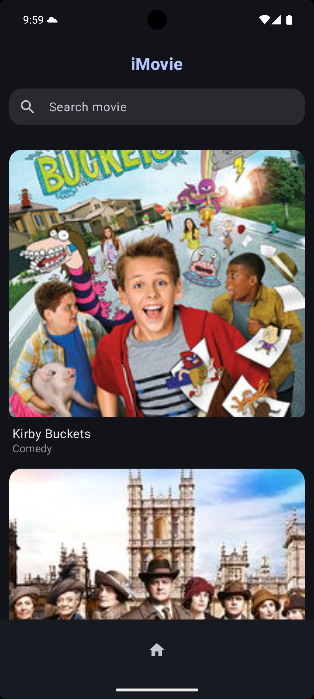
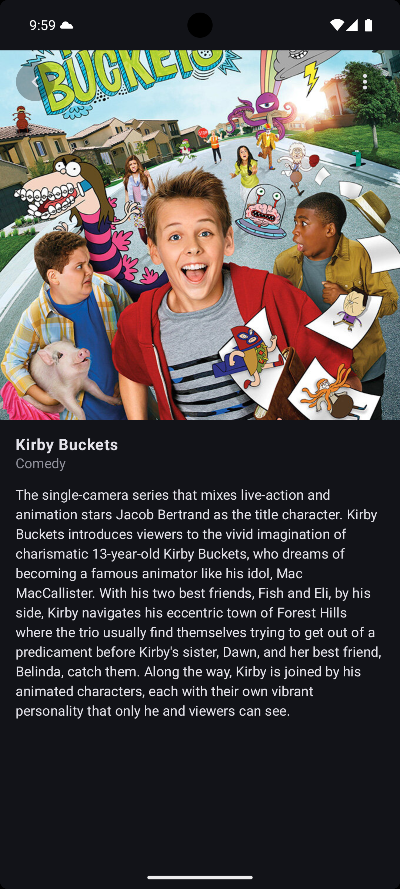

# iMovie

iMovie is an Android application built with Kotlin and Jetpack Compose that allows users to search and explore TV shows using [https://api.tvmaze.com/](https://api.tvmaze.com/) API. The app features modern UI components, local data persistence, and clean architecture practices.

# Features
- Search Movies/Shows – Search and browse popular movies or TV shows using the TVmaze API.
- Movie List View – Display a list of shows with key information and cover images.
- Detailed Movie View – See full details of a selected TV show.
- Offline Support – Saves previously fetched shows using Room so the app still works when offline.
- Modern Android Stack – Built entirely with Jetpack Compose and follows MVVM with Clean Architecture.

# Tech Stack
- Language: Kotlin
- UI: Jetpack Compose
- Network: Retrofit
- Image Loading: Coil
- Dependency Injection: Hilt
- Database: Room
- Serialization: Gson
- Logging: Timber
- Architecture: MVVM + Repository Pattern
- Testing: JUnit, Mockito

# Dependencies
- **Retrofit** for making network requests.
- **Room** for data persistence
- **Gson** for parsing JSON responses.
- **Coil** for loading images.
- **Timber** for logging, providing a simple and effective way to log messages during development.
- **Hilt** for dependency injection, making it easier to manage dependencies throughout the app.
- **Mockito** for unit testing and mocking dependencies in test cases.
- **JUnit** for unit testing the app’s functionality.

# Screenshots

